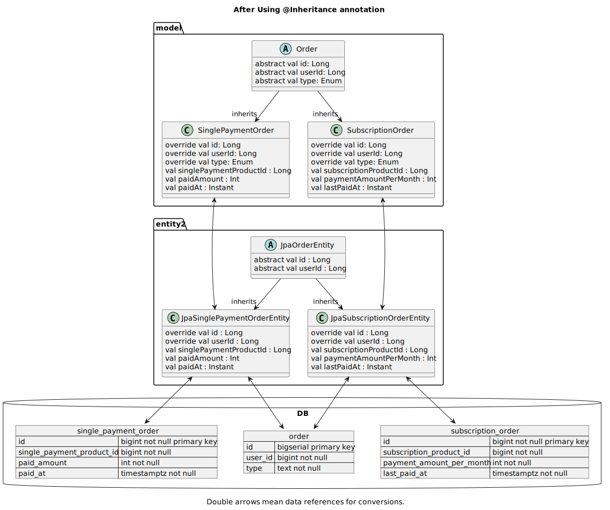

# `examples-jpa-polymorphism`

다형성(Polymorphism)이 적용된 모델에 대한 JPA 엔티티를
`@Inheritance` 어노테이션을 이용하여 재작성하여 쿼리를 간략화한 예시입니다.

Also see : [JPA Polymorphism을 활용한 코드 리팩토링 예시 소개 #7](https://github.com/wonsim02/spring-kotlin-exercise/pull/7)

## `@Inheritance` 적용 이전 다이어그램


## `@Inheritance` 적용 이후 다이어그램



## 테스트 실행 방법

### Windows

```shell
./gradlew.bat :examples:examples-jpa-polymorphism:test
```

### Linux / Mac

```shell
./gradlew :examples:examples-jpa-polymorphism:test
```
