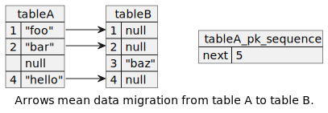

# `examples-share-row-id-sequence`

서로 다른 2개의 테이블 A, B가 PK 값을 공유하지 않도록 DDL을 작성한 예시입니다.
이는 테이블 A에서 테이블 B로 데이터 마이그레이션 도중 테이블 B에만 행을 추가할 때
테이블 A로부터 마이그레이션된 데이터가 PK 값을 유지할 수 있도록 하는 데 유용합니다.



Also see : [서로 다른 2개의 테이블이 동일한 PK를 가지지 않도록 DDL을 작성한 예시 소개 #11](https://github.com/wonsim02/spring-kotlin-exercise/pull/11)

## 테스트 실행 방법

### Windows

```shell
./gradlew.bat :examples:examples-share-row-id-sequence:test
```

### Linux / Mac

```shell
./gradlew :examples:examples-share-row-id-sequence:test
```
